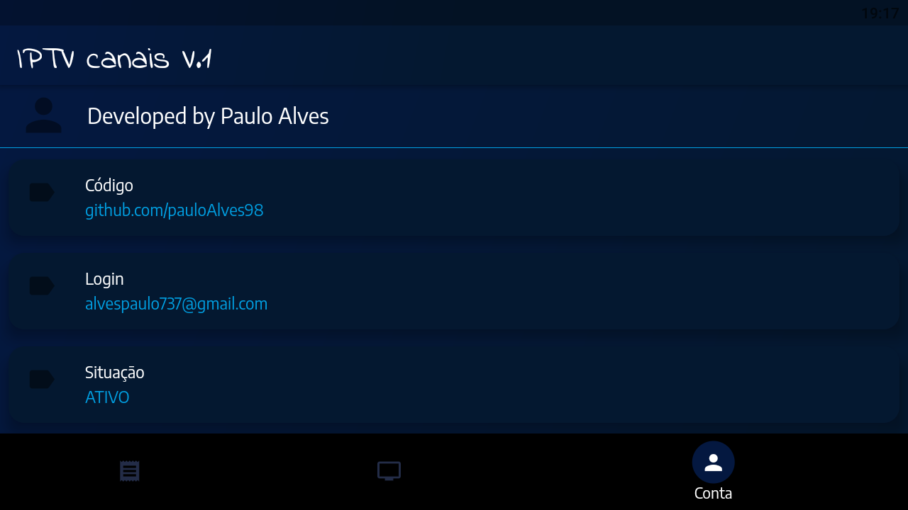
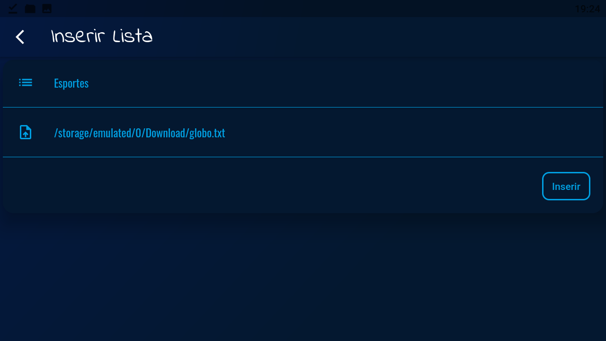
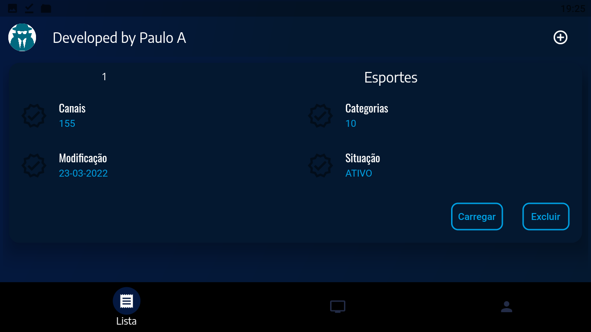
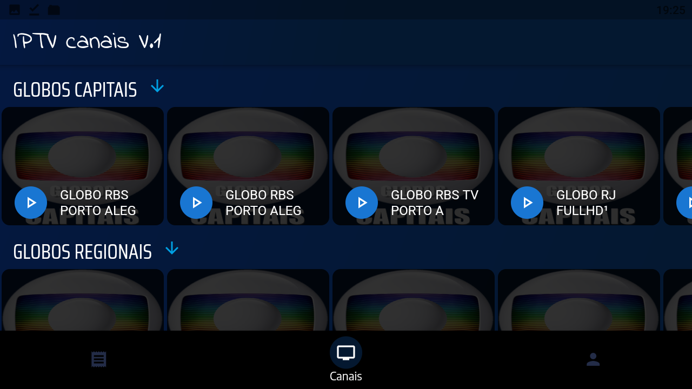
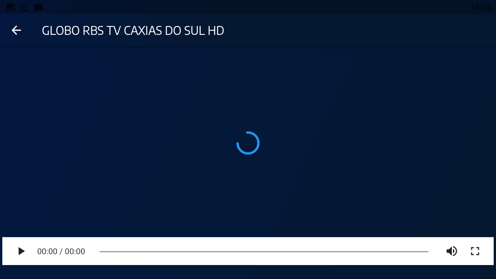
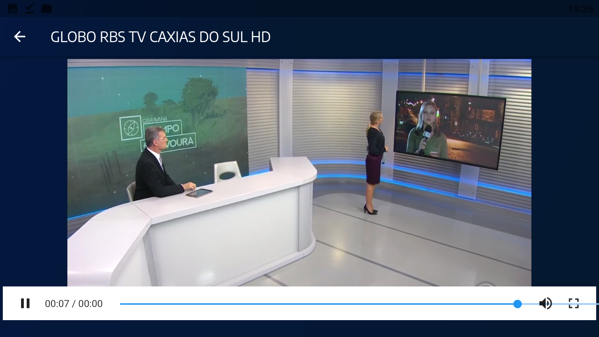

# Reprodutor de Listas IPTV

Este é um aplicativo básico de reprodução de listas IPTV e alguns streams, com funcionalidades de captura e categorização de arquivos de mídia alocados no dispositivo.

## Screenshots 📷

### Sobre
 

### Inserir

### Lista inserida
 

### Detalhes da lista inserida
 

### Lista de canais
 

### Carregando canal
 

### Canal carregado

### Tela cheia
 

## Como usar 🤔

Para utilizar este aplicativo, basta baixar o código fonte e instalá-lo em seu dispositivo móvel.

## Contribuindo 🤝

Se você deseja contribuir com este projeto, sinta-se à vontade para enviar sugestões de melhorias e correções de bugs.

